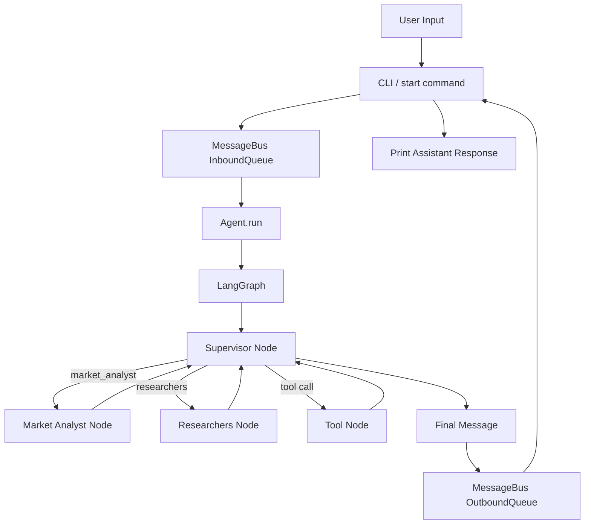

# Finabot Framework

## 1. Overall Flow

## 2. Runtime Entry Points

### `finabot/cli/commands.py`

- `finabot start`: starts the interactive CLI.
- `--message`: sends one message and waits for one response.
- `--session`: sets the session key.
- Handles `Ctrl+C` and exits cleanly.

### `finabot/__main__.py`

- Allows running the package directly with `python -m finabot`.
- Forwards to the Typer CLI app.

## 3. Core Components

### `finabot.bus.events`

- `InboundMessage`: user message entering the system.
- `OutboundMessage`: agent reply leaving the system.
- Session key is derived from `channel:chat_id`.

### `finabot.bus.queue`

- `MessageBus` owns two async queues:
- `inbound`: user -> agent
- `outbound`: agent -> user
- Decouples channels from agent execution.

### `finabot.agents.core`

- `Agent.run()` consumes inbound messages forever.
- Each message is processed in its own task.
- Maintains session state and a TTL-based session manager.
- Publishes final output to the outbound queue.

### `finabot.graph.graph`

- Builds the LangGraph state machine.
- Current flow is:
  - `supervisor` node
  - `market_analyst` node
  - `researchers` node
  - `tool` node
  - conditional edge back to `supervisor`
- Graph ends when the supervisor returns no tool calls.

### `finabot.agents.nodes`

- `call_llm_node`: calls LiteLLM and converts the result into `AIMessage`.
- `call_tool_node`: executes the selected tool and returns `ToolMessage` objects.
- `should_continue`: routes to `tool` if the LLM asked for a tool.
- Includes fallback parsing for serialized tool-call text.

### `finabot.agents.llm`

- Normalizes provider names for LiteLLM.
- Builds `role/content` message payloads.
- Serializes tool-call history back into the format LiteLLM expects.

### `finabot.tools.base`

- Exposes the calculator tool.
- Calculator is implemented with a safe AST-based evaluator, not `eval()`.

### `finabot.agents.session`

- Stores per-session history.
- Removes expired sessions based on TTL.

## 4. Message Lifecycle

1. User types a message in CLI.
2. CLI creates `InboundMessage` and puts it into `MessageBus.inbound`.
3. `Agent.run()` consumes the inbound message.
4. Agent loads or creates session state.
5. LangGraph runs the LLM node.
6. If the supervisor requests a sub-agent, the corresponding node runs and returns to the supervisor.
7. If the supervisor requests a tool, the tool node runs the tool and returns to the supervisor.
8. When the LLM produces a final answer, the agent publishes `OutboundMessage`.
9. CLI consumes the outbound message and prints it.

## 5. Current Design Goals

- Keep channel logic and agent logic separated.
- Use a queue as the transport layer.
- Make tool execution explicit and traceable.
- Keep the CLI responsive and able to exit cleanly.
- Avoid unsafe dynamic code execution.

## 6. Extension Points

You can extend this framework in three main directions:

- Add more tools in `finabot.tools`.
- Add more channels in `finabot.channels`.
- Replace the single LLM/tool loop with a multi-agent graph.

## 7. Suggested Next Step

The graph layer in `finabot/graph/graph.py` now follows a `Supervisor -> Market Analyst / Researchers / Tool -> Supervisor` design and can be extended with more analyst nodes in the same pattern.
